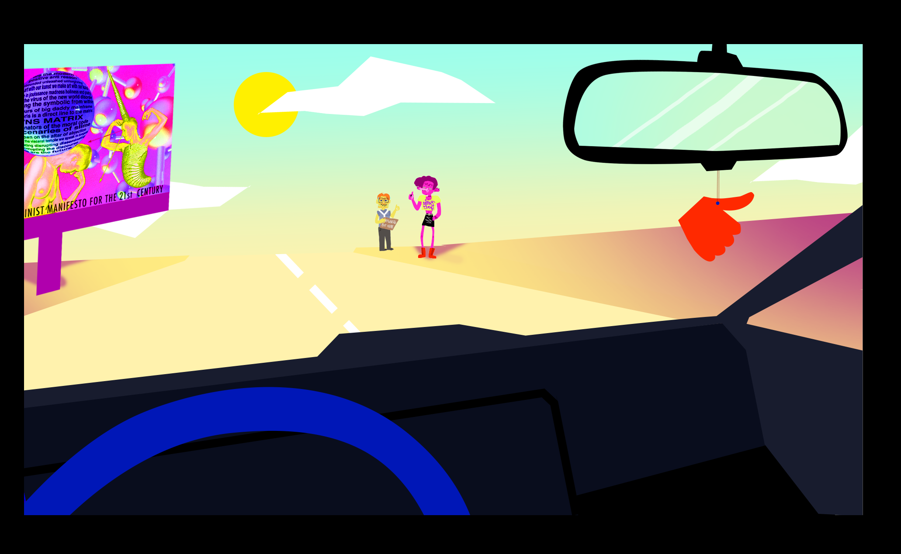
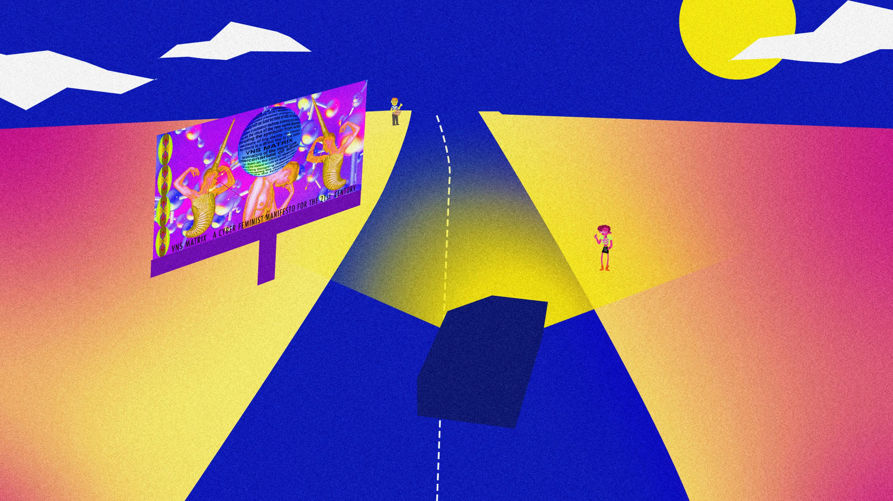
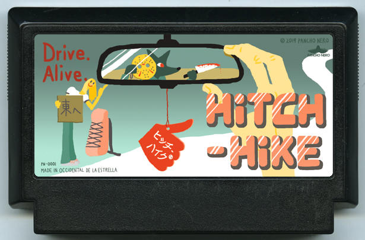
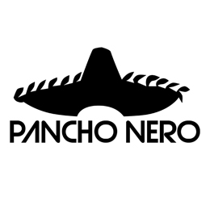

# Hitch-Hike

*Hitch-Hike* is a first-person adventure game where you drive a car along a desert road, picking up travelers along the way & helping them to get where they're headed.

**This is a work-in-progress in active development.**

Made for the [2021 A Game By Its Cover jam](https://itch.io/jam/a-game-by-its-cover-2021).

*Concept art by Noli.*

*Concept art by Noli.*

Based on the [2019 My Famicase Exhibition](https://famicase.com/19/) entry by Scott Polhemus & nomi.

## Our Team
Noli, Po, LGM, Nomi & Benji

## Hitch-Hike
### Scott Polhemus & nomi｜Writer & Designer
*It's summer break. You bought an old car for a cross-country drive back home. Along the way you'll come across hitch hikers -- some will benefit your journey, others may lead you to all kinds of "Game Over". Good luck, Samaritan.*

